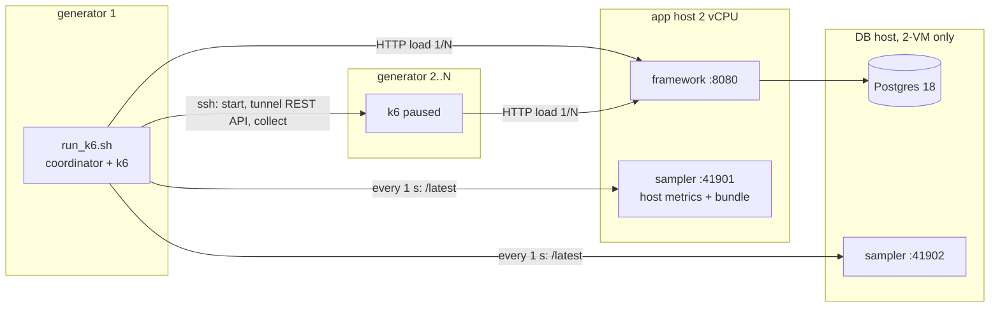

# bench7: one API, 8 frameworks, same box, same load

One social-media API (public feed from an in-process cache, private posts, messages, send
message, create post) written 8 times. Each one is benchmarked on its own on one small app VM
serving `:8080` directly (no proxy), with Postgres 18 either on the same box (1-VM) or on its own
VM (2-VM). The load comes open-loop from k6 on one or more generator VMs.

**Step-by-step commands: [howto.readme](howto.readme).**

| framework | start / stop on the app host | stack |
|---|---|---|
| FastAPI | `./run_fastapi.sh` / `./kill_fastapi.sh` | Python 3.13, uvicorn + uvloop (1 worker per vCPU), asyncpg, orjson |
| Bun | `./run_bun.sh` / `./kill_bun.sh` | `Bun.serve` + `Bun.sql`, 1 process per vCPU (SO_REUSEPORT) |
| Node | `./run_node.sh` / `./kill_node.sh` | Node.js + Fastify 5 + postgres.js, `cluster` with 1 worker per vCPU |
| Fastify on Bun | `./run_fastify_bun.sh` / `./kill_fastify_bun.sh` | the Node app, run by Bun |
| Spring Boot | `./run_springboot.sh` / `./kill_springboot.sh` | Java 25, Spring Boot WebMVC (Tomcat) on virtual threads, HikariCP + JDBC |
| Gin | `./run_gin.sh` / `./kill_gin.sh` | Go, Gin + pgx v5 |
| ASP.NET | `./run_aspnet.sh` / `./kill_aspnet.sh` | .NET 10 minimal API (Kestrel) + Npgsql |
| Axum | `./run_axum.sh` / `./kill_axum.sh` | Rust, Axum 0.8 + tokio + sqlx |

## Workload

75 % reads with ~3 KB responses, 25 % writes of `--payload-kb` (default **5 KB**; the apps accept bodies up to 8000 chars).
Mix: `public:56.25,private:6.25,list_messages:12.5,send:15,create_post:10`.

- Reads: 3/4 are cache-served public pages; 1/4 are direct Postgres reads (private posts and messages).
- Writes (Group 1, default): batched in the app. Each table has `BATCH_LANES` flush lanes; rows are routed by
  user (posts), conversation (messages) or post (likes), so related rows keep their order. A lane flushes at
  `BATCH_MAX_ROWS` rows or `BATCH_WINDOW_MS` after its first row, as one multi-row upsert
  (`INSERT ... SELECT FROM unnest(...) ON CONFLICT (id) DO NOTHING`). The request is answered after that commit.
  Transient errors are retried 3 times (50/100/200 ms), then the batch fails with 500 and a `BATCH FAILED` log line.
  A full lane queue answers 503. `STATEMENT_TIMEOUT_MS` (5000) is set on the app's connections.
- Group 2 (`run_k6.sh --design normal`, routes under `/n`): one INSERT per write request, every read hits Postgres, no cache.

The pool and batching profile is chosen by `run_<fw>.sh` from where the database is (override: `--profile`, `--set`):

| profile | when | `DB_POOL_TOTAL` | `BATCH_LANES` | `BATCH_MAX_ROWS` | `BATCH_WINDOW_MS` |
|---|---|---:|---:|---:|---:|
| `1vm` | Postgres on the app host | 12 | 1 | 200 | 20 |
| `2vm` | `--db-host <db-ip>` | 24 | 4 | 1000 | 20 |

On one 2 vCPU box the app and Postgres share the CPU: there is no idle fsync time for extra lanes to fill, and
extra lanes only hold more connections and more in-flight requests. With Postgres on its own VM, 4 lanes keep
its WAL flushes busy in parallel.

## Scripts

| step | where | script |
|---|---|---|
| 1 | every machine | `./tune_linux.sh` |
| 2 | DB machine | `./setup_postgres.sh [--data-gb N]` |
| 2.1 | DB machine, 1-VM | `./tune_postgres1.sh [--set name=value]...` |
| 2.2 | DB host, 2-VM | `./tune_postgres2.sh [--allow CIDR] [--set name=value]...` |
| 3 | DB machine | `./seed_db.sh [--size-gb N] [--reseed] [--no-follow] [--force]` (already seeded: back to the seed in seconds) |
| 4 | app host | `./setup_toolchain.sh [--no-build] [framework...]` |
| 5 | app host | `./run_<fw>.sh [--db-host IP] [--profile 1vm\|2vm] [--set K=V]... [--build] [--no-clean]`, `./kill_<fw>.sh` |
| live | app host / DB host | `./watch_server.sh [--log] [--port N]` |
| 6 | generator 1 | `./connect_agent.sh [user@host...]` |
| 7 | generator 1 | `./run_k6.sh --ip IP ...` (all options: `--help`) |
| undo | any machine | `sudo ./reset.sh [-y] [--all]` |

Behind them: `scripts/fw.sh` (run/kill/build), `scripts/app.sh` (runtime settings per framework),
`scripts/install-pg.sh`, `scripts/install-toolchains.sh`, `scripts/tune.sh`, `scripts/sampler.py`,
`db/seed.sh` / `db/reseed.sh` / `db/wipe.sh` / `db/reset.sql`, `loadgen/loadtest.py` + `loadgen/bench.js` + `loadgen/report.py`.

### Seed size

`./seed_db.sh --size-gb N` scales every table by N/29 (full set: 500k users, 7M posts, 1.4M messages, 8M likes,
~29 GB, ~33 min on 2 vCPU). `--size-gb 3` loads in about 2 minutes. The seed ids k6 uses are stored in the database
(`bench_meta.seed_export`) and read by `run_<fw>.sh` from the database it talks to.

After a test, `./seed_db.sh` on an already seeded database returns it to the seed without loading again: every
app only inserts (UUIDv7 ids, newer than the seed's max ids kept in `bench_meta`) and bumps counters, so
`db/reset.sql` deletes the rows above those ids, recomputes the counters of the rows they touched and vacuums.
It then checks each table's row count against the seed. The freed space is reused by the next test, so the
database stays near its fresh size (`bench_meta.seed_db_bytes`) instead of growing.

### What `run_<fw>.sh` does

1. 2-VM (`--db-host IP`): installs the Postgres client if missing, asks once for the DB host's password and keeps it
   as `PG_PASSWORD_REMOTE` in `bench7.env`; stops the local Postgres, if any, and releases its huge pages.
2. Reads the seed ids from the database into `results/seed-export.json`.
3. Stops any running app and deletes the rows the previous test wrote (`db/reset.sql`; skip: `--no-clean`).
4. Installs the framework's toolchain and builds the app if it is not built yet (`--build` forces a rebuild).
5. Starts the app (`scripts/app.sh`, systemd unit `bench7-app`) with the profile above.
6. Mints 512 JWTs and writes the bundle the generators need (seed ids plus tokens).
7. Starts the metrics sampler on `:41901` and prints the `run_k6.sh` command.

### Firewall

Only the private network needs to be open:
- generators -> app host: `:8080` (app) and `:41901` (sampler: metrics + bundle)
- generator 1 -> DB host: `:41902` (2-VM); app host -> DB host: `:5432`
- generator 1 -> other generators: `:22` (ssh)

## Distributed k6 (2+ generators)

`run_k6.sh` on generator 1 is the coordinator (no k6 cloud / operator):

1. It downloads the bundle from the app host (`:41901/bundle`) and copies `bench.js` + bundle to every agent over ssh.
2. It starts k6 **paused** on every machine (remote REST APIs tunnelled to `127.0.0.1:6566, 6567...`); each runs the
   same profile at 1/N of the rate.
3. Once every k6 has initialized its VUs, it resumes them all at the same moment.
4. Every second it reads every k6 (`/v1/metrics`) plus the samplers, merges them, and writes `timeline.ndjson` and
   `live.log`. Percentiles come from merged histograms, not averaged percentiles.
5. When a stop rule fires it stops every k6, copies the agents' logs back and deletes temp files and tokens.

Add a generator when the report says the generator is the bottleneck or `gen CPU` goes above ~60 %.

## Results and reports

Every second `timeline.ndjson` gets: k6 (all generators merged: target/achieved RPS, status classes, latency
histograms overall and per endpoint, VUs, dropped iterations, cache hit/miss), generator CPU/memory, and the app host
(and DB host) sampler: CPU per core, app and Postgres process CPU/RAM, disk IOPS/MB/s/await/util, Postgres TPS, cache
hit %, WAL MB/s, lock waits, network, TCP.

`report.md` groups the timeline into 5 s steps and lists a step only while RPS is still climbing. The headline is
**max RPS within SLO**: the best 5 s step with p95 within `--p95` and errors within `--err`. App and Postgres CPU are
% of one core (200 = both vCPUs).

| file in `results/<name>-<time>/` (generator 1) | what |
|---|---|
| `report.md`, `report.json` | the report and its headline numbers |
| `timeline.ndjson`, `live.log` | 1 Hz raw data, 1 line/s |
| `summary.*`, `agent-*` | k6 end-of-test summaries |
| `meta.json`, `stop.json` | settings, why and when it stopped |

The app host keeps `results/host/<fw>-<time>/` (`host.ndjson`, `host-info.txt`, `app.log`); the DB host keeps
`results/dbhost/<time>/`. Re-render a report: `python3 loadgen/report.py results/<dir>`.

## Runtime settings (set by `scripts/app.sh`)

| framework | settings | why |
|---|---|---|
| ASP.NET | `DOTNET_gcServer=1`, `DOTNET_GCDynamicAdaptationMode=0`, `DOTNET_ThreadPool_UnfairSemaphoreSpinLimit=0`, `TieredPGO` | DATAS GC and thread-pool spin-waiting burn CPU that Postgres needs |
| Gin | `GOGC=400`, `GOMEMLIMIT=1GiB`, `GIN_MODE=release` | fewer GC cycles; memory is capped instead |
| Spring | `-XX:+UseParallelGC`, fixed heap (40 % of RAM), `-Xss512k` | no heap resizing during the ramp |
| Node / Bun / FastAPI | one process per vCPU, `NODE_ENV=production` | single-threaded runtimes need one process per core |

## Every setting, and where it lives

| component | file |
|---|---|
| kernel, limits, THP, disks, background services | `scripts/tune.sh` (via `tune_linux.sh` / `connect_agent.sh`) |
| Postgres | `db/postgresql.conf` (+ `db/postgresql-dbhost.conf` for 2-VM), `--set` extras in `conf.d/zzz-bench7-extra.conf`, all by `scripts/install-pg.sh` |
| huge pages | `scripts/install-pg.sh` -> `/etc/sysctl.d/91-bench7-hugepages.conf` |
| tables | `db/schema.sql`, `db/seed.sh`, `db/reset.sql` |
| `/data`, units | `deploy/systemd/*`, `scripts/install-units.sh`, `scripts/prepare-data.sh` |
| app runtimes, pool, batching | `scripts/app.sh` (defaults) and `scripts/fw.sh` (profiles) |
| generators | `connect_agent.sh` (k6 v2.3.0, port and file limits) |

`/data` is the VM's ephemeral local NVMe: it can come back blank after a VM stop (not after a reboot). Run
`./setup_postgres.sh` again (it re-creates the cluster and re-applies the saved `tune_postgres` command), then seed.

## Gotchas

- `pgrep -f` / `pkill -f` match their own command line. Use the bracket trick: `pkill -f '[s]ampler.py'`.
- Ctrl-C in `run_k6.sh` is safe and still writes a report. Killing the ssh session also stops the remote k6.
- `cannot get the bundle`: the app is not running (`./run_<fw>.sh`) or a firewall blocks `:41901`.
- `not every k6 became ready`: an agent failed; usually k6 is missing (`./connect_agent.sh <agent>`) or ssh failed (`ssh -A`?).
- Run one framework and one load test at a time.
